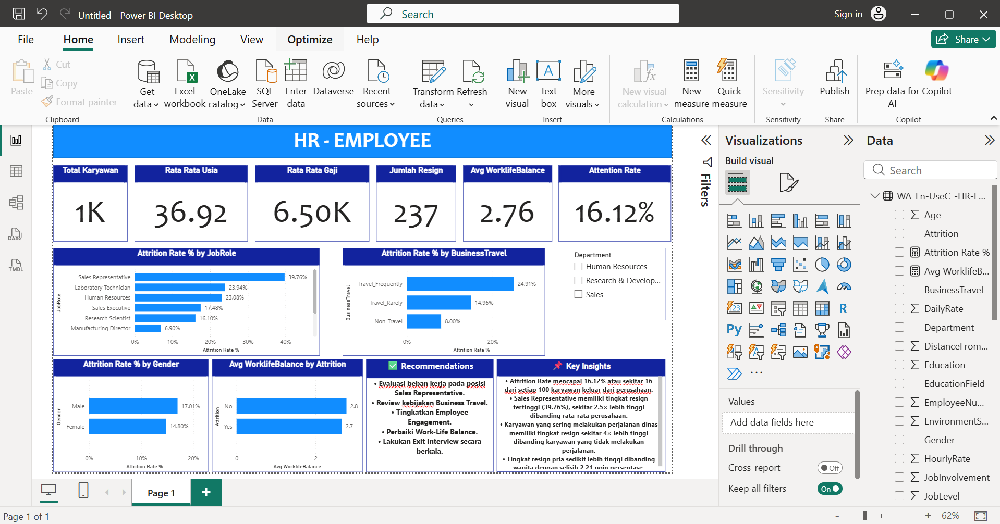

# HR Employee Attrition Dashboard

## Overview

This dashboard analyzes employee attrition using Power BI to identify workforce trends, resignation patterns, and key factors influencing employee turnover.

---

## Dashboard Preview

---

## Objectives

- Monitor employee attrition rate.
- Identify departments and job roles with high resignation rates.
- Analyze the impact of business travel on attrition.
- Compare attrition by gender.
- Evaluate work-life balance of employees.

---

## Key Performance Indicators (KPIs)

- Total Employees
- Average Age
- Average Salary
- Total Resigned Employees
- Average Work-Life Balance
- Attrition Rate

---

## Key Insights

- Overall attrition rate is **16.12%**, meaning around 16 out of every 100 employees leave the company.
- Sales Representatives have the highest attrition rate (39.76%), around 2.5× higher than the company average.
- Employees who travel frequently show a significantly higher attrition rate than non-travel employees.
- Male employees have a slightly higher attrition rate than female employees.
- Employees who resigned generally reported lower work-life balance.

---

## Recommendations

- Evaluate workload for Sales Representatives.
- Review business travel policies.
- Improve employee engagement programs.
- Enhance work-life balance initiatives.
- Conduct regular exit interviews to identify resignation causes.

---

## Tools Used

- Microsoft Power BI
- Power Query
- DAX
- Data Modeling

---

## Dataset

IBM HR Analytics Employee Attrition Dataset

---

## Files

- HR Employee Attrition Dashboard.pbix
- dashboard.png
- README.md
