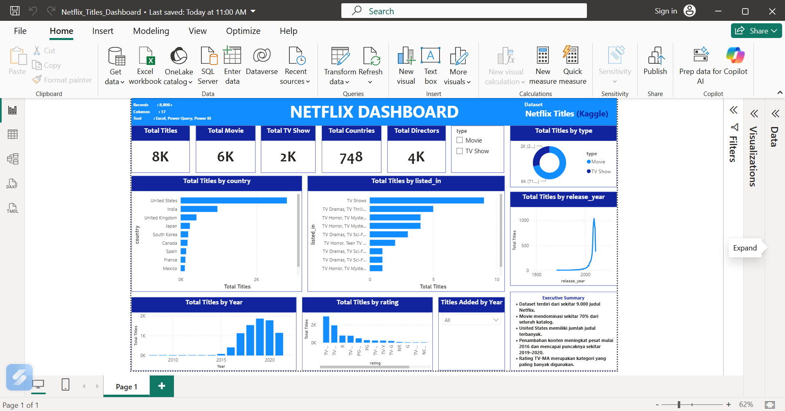

# 🎬 Netflix Titles Dashboard

## 📌 Project Overview

This project analyzes the Netflix Titles dataset using Microsoft Power BI. The dashboard provides insights into Netflix's content library, including content types, countries, genres, ratings, and release trends.

---

## 📊 Dashboard Preview

---

## 🎯 Objectives

- Analyze the distribution of Movies and TV Shows.
- Identify countries with the highest number of Netflix titles.
- Explore the most common genres.
- Analyze content ratings.
- Observe release trends over time.

---

## 📈 Dashboard Features

### KPI Cards
- Total Titles
- Total Movies
- Total TV Shows
- Total Countries
- Total Directors

### Visualizations
- Titles by Country
- Titles by Genre
- Titles by Type
- Titles by Release Year
- Titles Added by Year
- Titles by Rating

---

## 🔍 Executive Summary

- The dataset contains approximately 9,000 Netflix titles.
- Movies account for around 70% of the total catalog.
- The United States has the highest number of titles.
- Netflix content increased rapidly after 2016 and peaked around 2019–2020.
- TV-MA is the most common content rating.

---

## 🛠 Tools Used

- Microsoft Excel
- Power Query
- Power BI

---

## 📂 Dataset

Netflix Titles Dataset from Kaggle.

---

## 📁 Project Files

- Netflix_Titles_Dashboard.pbix
- dashboard.png
- README.md

---

## 👤 Author

Gan Cepi

GitHub:
https://github.com/GanCepi075
