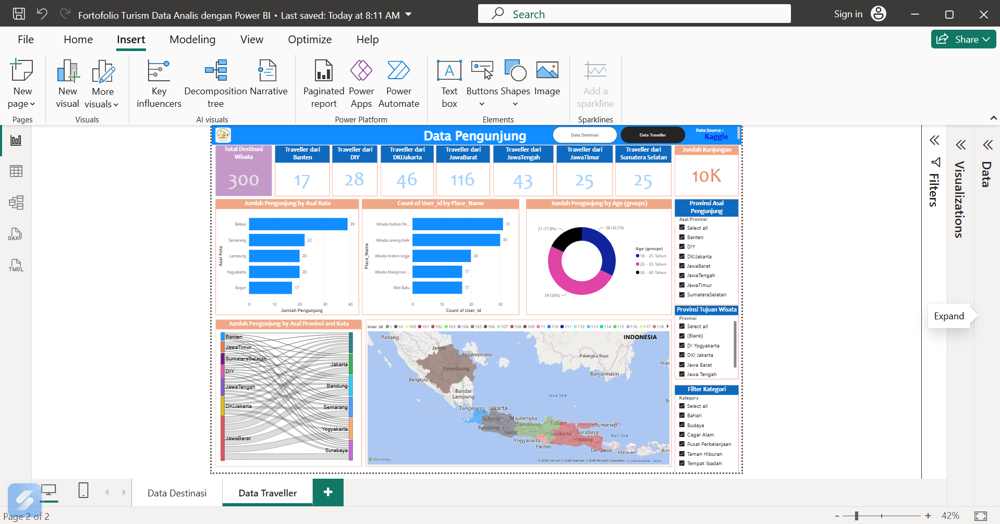
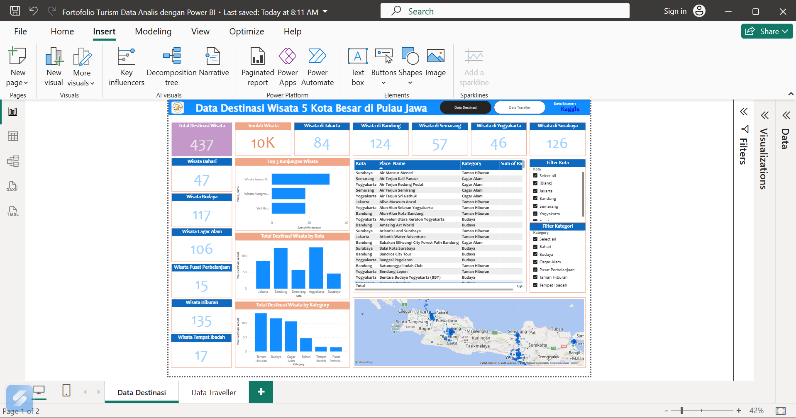

# 🏝 Tourism Destination Dashboard

## 📌 Overview
Dashboard ini dibuat menggunakan **Power BI** untuk menganalisis destinasi wisata di 5 kota besar di Pulau Jawa. Dashboard terdiri dari 2 halaman: **Data Destinasi** dan **Data Traveller**.

## 📊 Dashboard Preview

### Data Destinasi

### Data Traveller

## 🎯 Objectives
- Menganalisis jumlah destinasi wisata.
- Membandingkan kategori wisata.
- Menampilkan persebaran lokasi wisata.
- Menganalisis profil dan asal pengunjung/traveller.
- Membantu pengambilan keputusan berdasarkan data.

## 🛠 Tools
- Power BI
- Power Query
- DAX

## 📂 Files
- dashboard2.png
- dashboard3.png
- Fortofolio Turism Data Analis dengan Power BI.pbix
