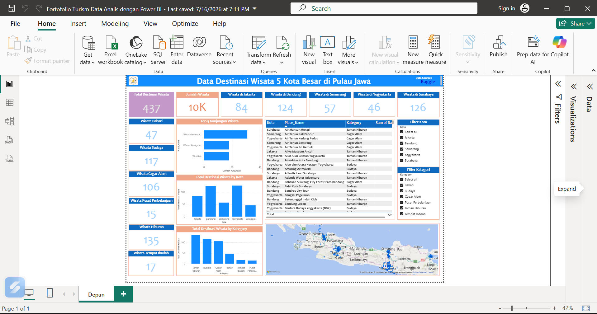

# 🏝 Tourism Destination Dashboard

## 📌 Overview
Dashboard ini dibuat menggunakan **Power BI** untuk menganalisis destinasi wisata di 5 kota besar di Pulau Jawa.

## 📊 Dashboard Preview

## 🎯 Objectives
- Menganalisis jumlah destinasi wisata.
- Membandingkan kategori wisata.
- Menampilkan persebaran lokasi wisata.
- Membantu pengambilan keputusan berdasarkan data.

## 🛠 Tools
- Power BI
- Power Query
- DAX

## 📂 Files
- dashboard.png
- Fortofolio Turism Data Analis dengan Power BI.pbix
